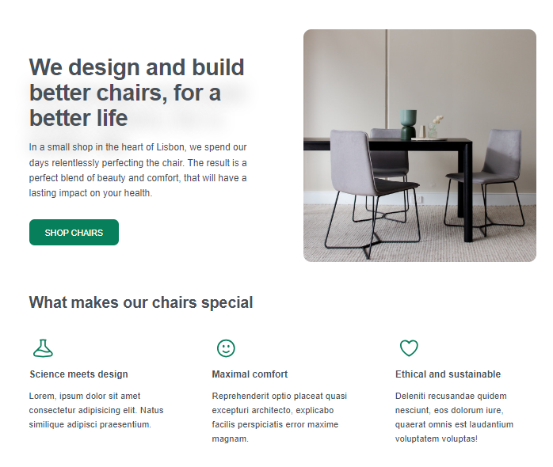

# Design Layout

## Overview
This project focuses on enhancing the visual appeal and usability of the application by adding typography, icons, shadows, and implementing visual hierarchy.

## Features
- **Typography**: Improved readability and aesthetics with well-chosen fonts.
- **Icons**: Added icons to enhance user experience and visual guidance.
- **Shadows**: Implemented shadows to create depth and highlight important elements.
- **Visual Hierarchy**: Structured content to guide users' attention effectively.

## Installation
1. Clone the repository:
    ```bash
    git clone https://github.com/HammadAlamgir007/HTML-CSS-basics.git
    ```
2. Navigate to the project directory:
    ```bash
    cd HTML-CSS-basics
    ```
3. Install dependencies:
    ```bash
    npm install
    ```

## Usage
1. Start the development server:
    ```bash
    npm start
    ```
2. Open your browser and navigate to `http://localhost:3000`.

## Contributing
Contributions are welcome! Please follow these steps:
1. Fork the repository.
2. Create a new branch (`git checkout -b feature-branch`).
3. Make your changes.
4. Commit your changes (`git commit -m 'Add some feature'`).
5. Push to the branch (`git push origin feature-branch`).
6. Open a pull request.


## Contact
For any questions or feedback, please reach out to hammadalamgir778@gmail.com.


